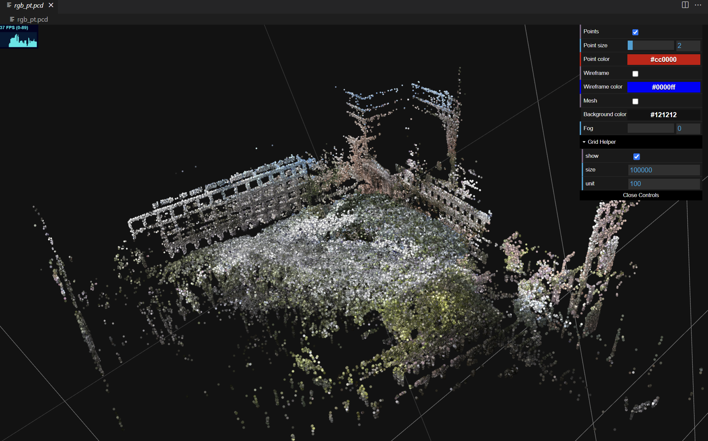
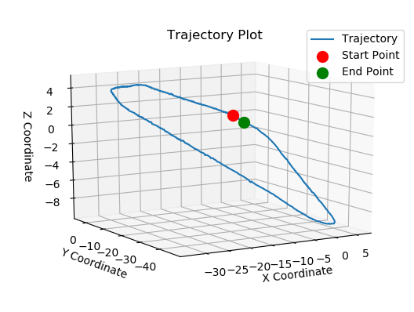
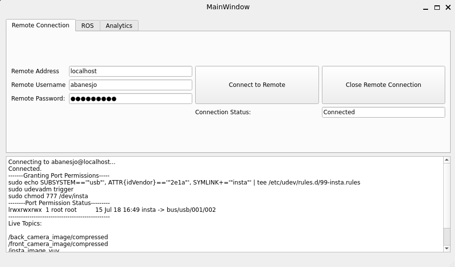
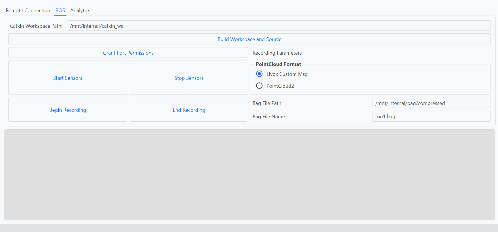
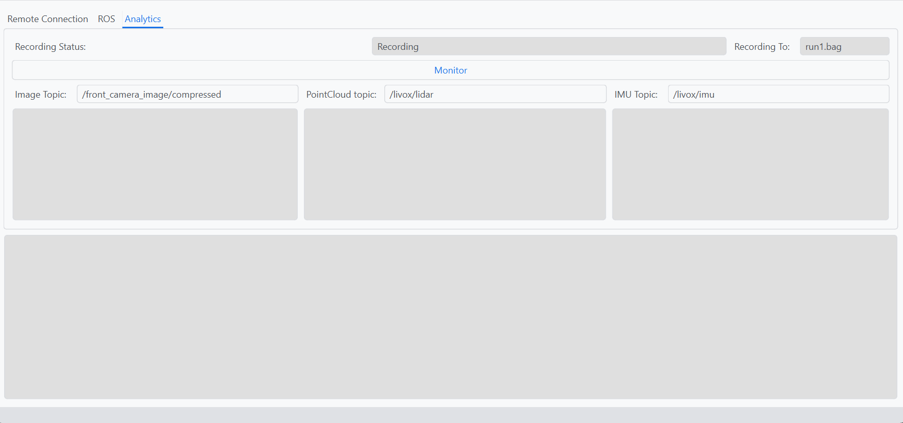

# Curb2Door

This repository contains code for the NYU Tandon Undergraduate Summer Research Program (UGSRP) Curb2Door Project. The project entails the collection and processing of 360 images and LiDAR pointcloud data in order to create a simulated environment viable for training autonomous navigation systems. 

---
## Table of Contents
1. [Installation](#Installation)
2. [Recording Data](#Recording-Data)
3. [Processing Data](#Processing-Data)
4. [Exporting Data](#Exporting-Data)
5. [Graphical User Interface](#graphical-user-interface)

---
## Installation
### Dependencies
The package files, along with the necessary submodules, can be installed with the following command. Make sure to run it in the ```catkin_ws/src``` folder. 
```
git clone --recurse-submodules https://github.com/Abanesjo/Curb2Door
```
Note that each of the submodules still requires their individual dependencies as listed as follows:
- [insta360_ros_driver](https://github.com/ai4ce/insta360_ros_driver)
- [livox_ros_driver2](https://github.com/Livox-SDK/livox_ros_driver2.git)
- [r3live](https://github.com/hku-mars/r3live)
- [livox_ros_driver_for_R2LIVE](https://github.com/ziv-lin/livox_ros_driver_for_R2LIVE)
- [SensorsCalibration](https://github.com/PJLab-ADG/SensorsCalibration)
- [livox_camera_calib](https://github.com/hku-mars/livox_camera_calib.git)
- [CameraCalibration](https://github.com/dyfcalid/CameraCalibration)

## Recording Data
For recording data, it is recommended to use the [Graphical User Interface](#graphical-user-interface) to simplify the process. However, it can be done manually as well.

The LiDAR and camera can be activated using the following
```
roslaunch curb2door bringup.launch
```
Below are the launch file arguments.
| Argument | Values (Default) | Description |
| ----------- | ----------- | -----------  | 
| lidar_msg | CustomMsg/PointCloud2 (CustomMsg) | Point Cloud Message Type |
| rviz | True/False (False) | Show live data using RViz |

To begin recording data, the launch file can be used.
```
roslaunch curb2door record.launch
```
Below are the launch file arguments.
| Argument | Values (Default) | Description |
| ----------- | ----------- | -----------  | 
| bag_path | (curb2door/compressed) | Directory to save recorded rosbag files |
| bag_name | (run.bag) | rosbag filename |
## Image Undistortion
Before using R3LIVE, the camera images must first be undistorted.
```
roslaunch curb2door undistort.launch
```
Below are the launch file arguments.
| Argument | Values (Default) | Description |
| ----------- | ----------- | -----------  | 
| config | (intrinsics.yaml) | .yaml file containing camera intrinsics |
| compressed_bag_folder | (curb2door/compressed) | Folder containing input bag files with distorted images |
| undistorted_bag_folder | (curb2door/undistorted) | Folder containing output bag files with undistorted images |

## R3LIVE
R3LIVE can be used to create a 3D map and also estimate odometry.
```
roslaunch curb2oor r3live.launch
```
Below are the launch file arguments.
| Argument | Values (Default) | Description |
| ----------- | ----------- | -----------  | 
| system | curb/red (curb) | system that is used. "curb" refers to the curb2door handheld mount, "red" refers to the red MappingNYC mount, etc. |
| rviz | True/False (True) | Show live 3D Mapping using RViz |
| bag_path | (curb2door/bag/undistorted) | Folder containing input bag files with image and pointcloud data |
| bag_file | (run_undistorted.bag) | Input bag filename |
| record | True/False (False) | Whether to record odometry to bag file |
| record_path | curb2door/bag/r3live_output | Path to save output bag files | 

An example 3D map is shown below.

## Exporting Data
Using the resultant bag file from R3LIVE, correspondence between camera frame and camera pose can be created. Before running each python file, **make sure that the file paths specified within them are correct.**
```
cd tools/data_processing
python bag_to_data.py # Converts bag file to odometry and image frames
python data_matching.py #Matches timestamps via indeces
python plot_data.py #Plots odometry data
```


## Graphical User Interface
A GUI has been developed to expedite data collection.

### Installation

#### Linux
For Linux, navigate to the **releases** tab and download the executable <code>curb2door_app</code>. Then, launch it using:
```
chmod +x curb2door_app
./curb2door_app
```
#### Windows
For Windows, navigate to the **releases** tab and download the executable <code>curb2door_app_lite.exe</code>. Then, launch it via double-clicking the app icon.

#### Mac
For Mac, an executable is not available. However, the app can be launched easily via conda. Navigate to the <code>tools/application_lite</code> folder. Then, run the following.
```
conda env create -f environment.yaml
conda activate gui
python3 main.py
```

### Usage
The app contains three primary tabs. The first tab allows a remote SSH connection with the robot to be established. If the app is running on the robot itself, you can set the remote address to "localhost". Otherwise, use <code>ifconfig</code> to determine its IP address.

<p style="text-align: center;">Screen for Establishing Remote Connection</p>



The second tab allows for compiling the ROS code, starting/stopping the sensors, and recording data. The standard procedure for recording data is as follows:

1. Ensure the correct catkin workspace path is set. Unless this has been changed, the default value should be OK.
2. Build and Source the workspace using the button if you've made any changes to the source code (on the robot)
3. Grant camera permissions to allow the 360 camera to be accessed using the button. To know if things worked properly, the text log should show something similar to the following line
```
/dev/insta -> /bus/usb/001/002
```
This shows that the symlink has been properly created. If it doesn't work, make sure that the camera is turned on. You can also try restarting the app and pressing it again.

4. **Before starting sensors**, make sure to select the POINTCLOUD FORMAT on the right hand side. Usually, for data collection, we want "Livox Custom Msg". However, for camera calibration, it is useful to have "PointCloud2". Note that you need to **make sure the sensors are stopped before changing these**.
5. If everything went well, you can press "Start Sensors". You can quickly go to the <code>Analysis</code> tab at the top and press "Monitor" to see the topics that you have. If all of them are publishing, then everything is working as intended.

6. To record data, make sure that the bag file path and bag file name are specified. **Make sure that the bag file path is sa folder that exists**, otherwise the file will not be saved.

7. Press "Begin Recording" to start collecting data and "End Recording" to save data.

8. Make sure to change the bag file name to prevent overwriting the previous recording.
<p style="text-align: center;">Screen for Managing ROS-Related Tasks</p>



The third screen, as mentioned earlier, provides useful live analytics for making sure that the sensors are working as intended.
<p style="text-align: center;">Screen for Monitoring Topics</p>

